# SCP Scientist Orientation #
The SCP Scientist Orientation is an interactive website in which the user takes a mostly-guided tour through an orientation process for a new Level 2 Scientist working at the fictional SCP Foundation. <br>
The purposefully sterile look of the site should belay the overall feel of the Foundation compared to what they do, with descriptions and images of protocols and SCPs, and links in the footnotes to the main source of information for them.<br><br>

The site's intended audience is those who are familiar with the SCP Foundation and enjoy perusing the non-canon content on offer, as well as those not massively familiar with the Foundation, <br>
as a way to stoke curiosity, with many links, images, and references to the main site to allow them to explore further.

## Features ##

## Design ##
### Wireframe ###

Login Page: <br>
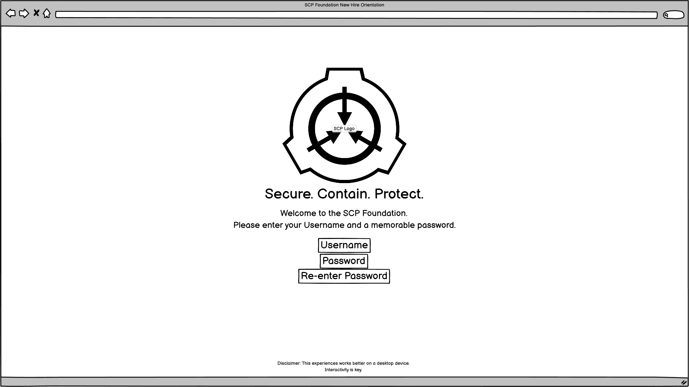

<br>

Login Page Mobile: <br>
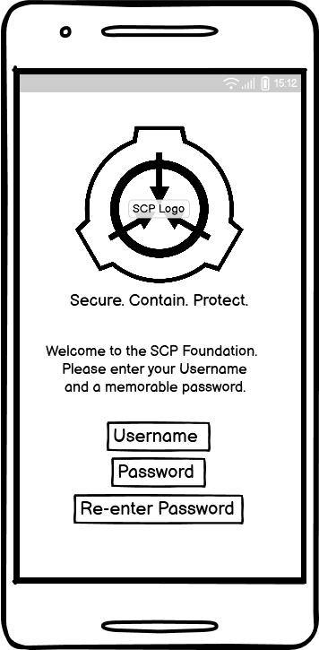

<br>

First Page: <br>
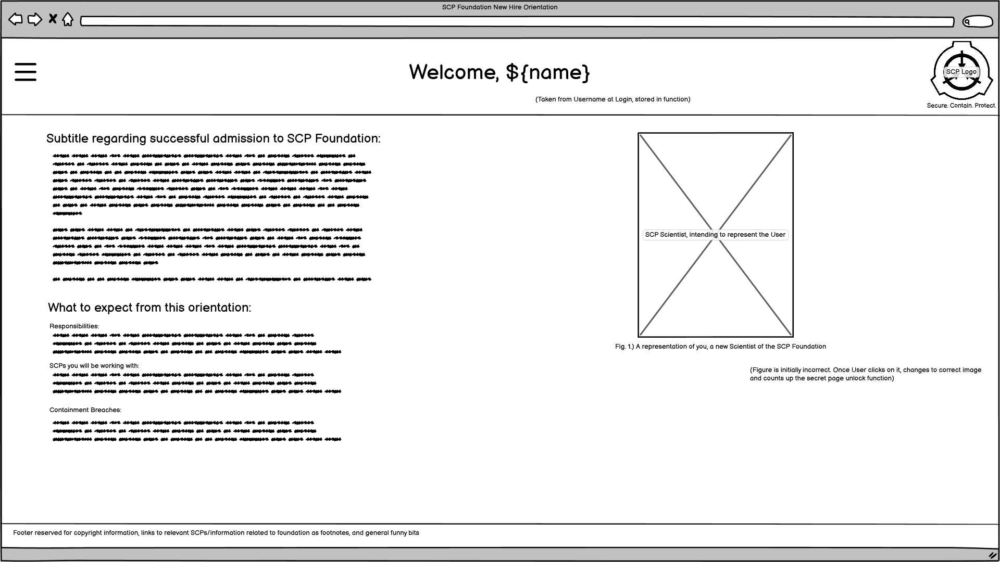

<br>

First Page Mobile: <br>
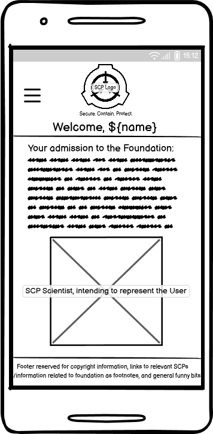

<br>

Second Page: <br>
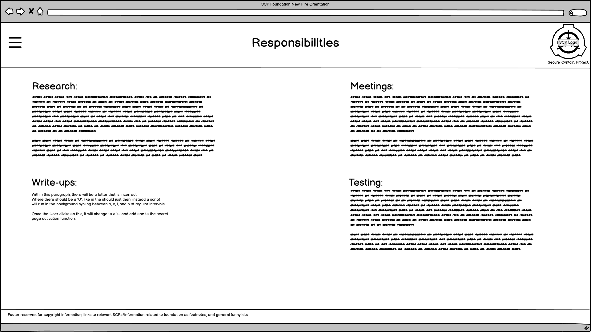

<br>

Second Page Mobile: <br>
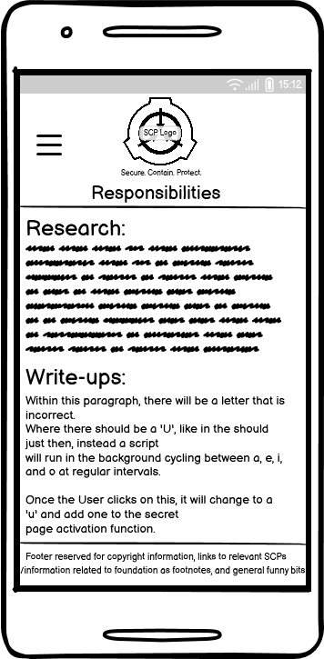

<br>

Third Page: <br>
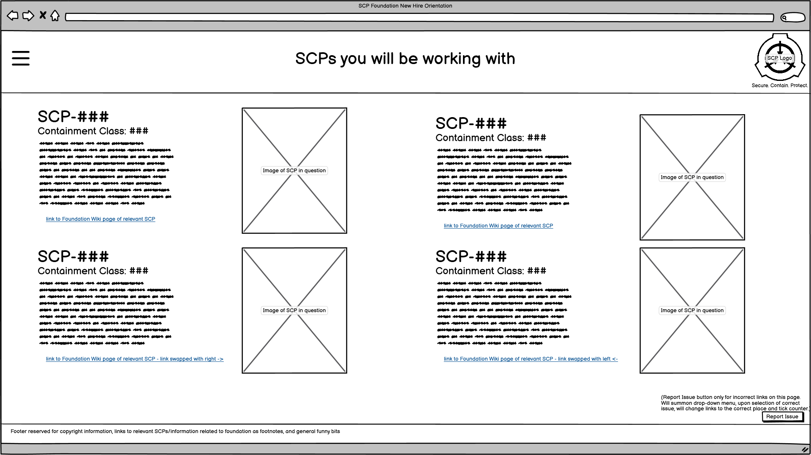

<br>

Third Page Mobile: <br>
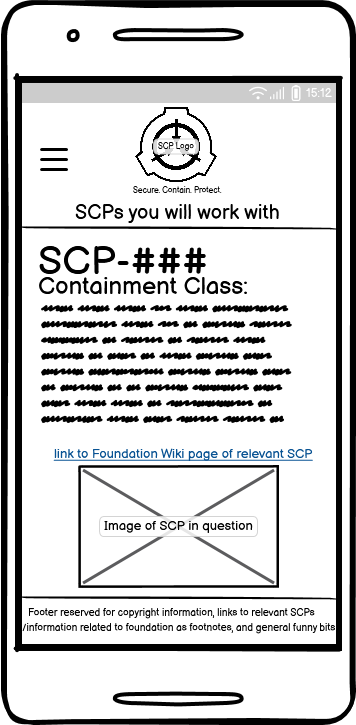

<br>

Fourth Page: <br>
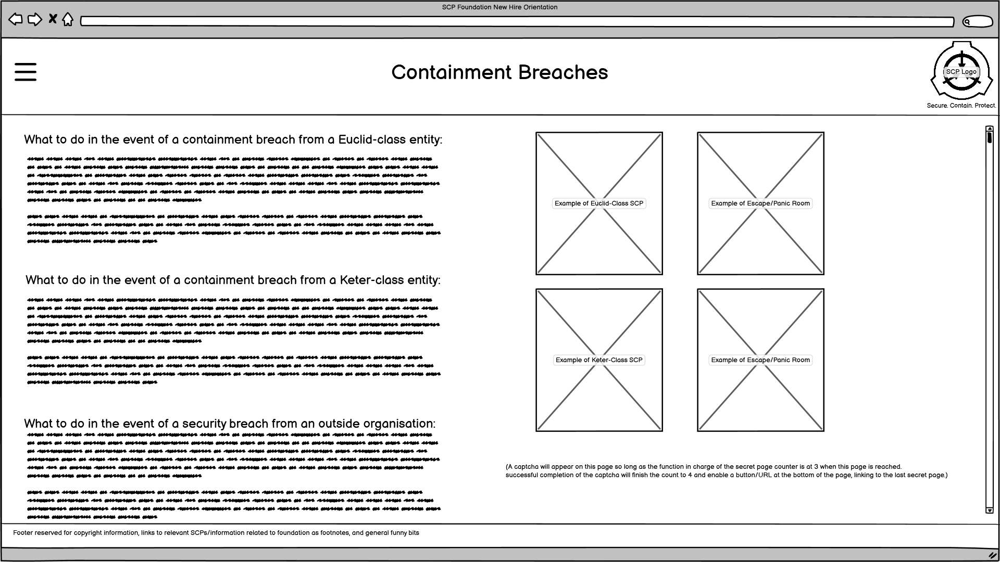

<br>

Fourth Page Mobile: <br>
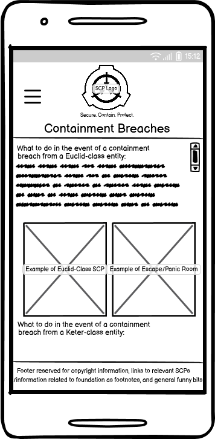

<br>

Secret Page: <br>
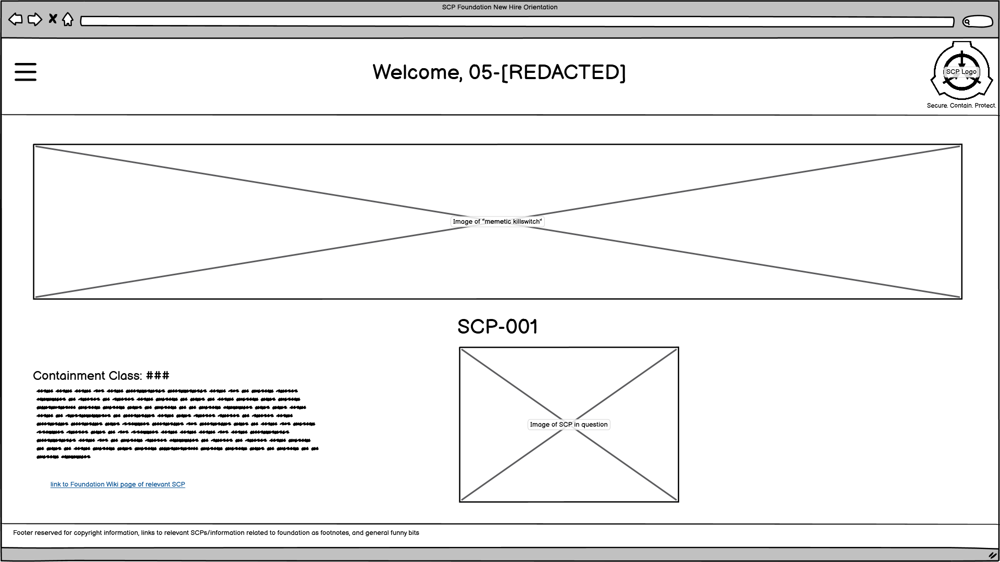

<br>

Secret Page Mobile: <br>
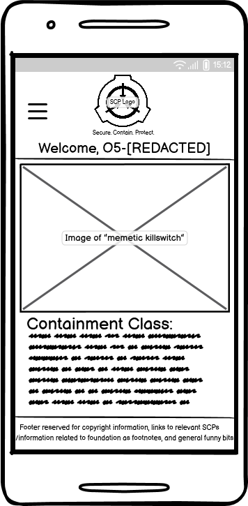

<br>

Final Page: <br>
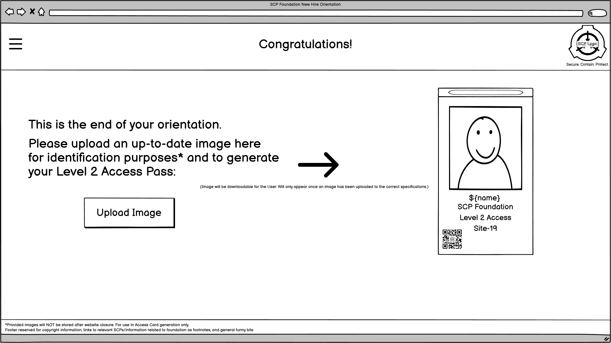

<br>

Final Page Mobile: <br>
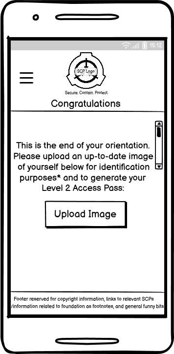

<br>

404 Page: <br>
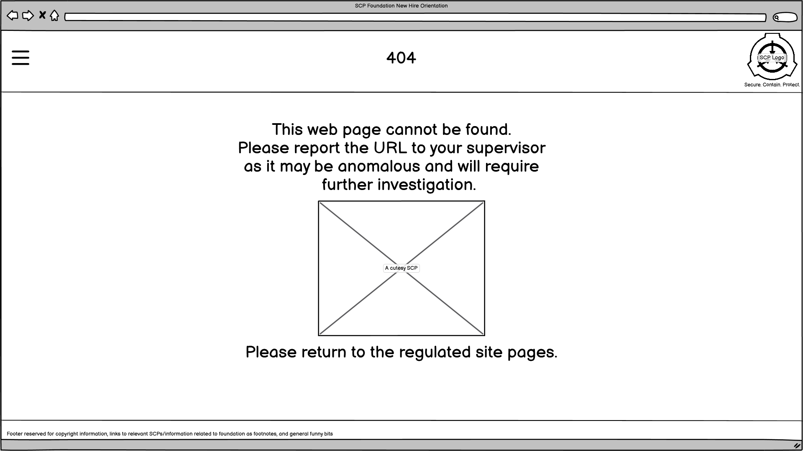

<br>

404 Page Mobile: <br>
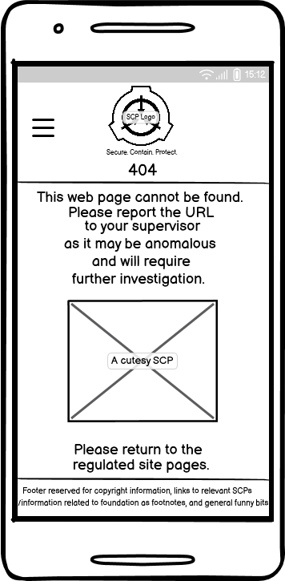

<br>

## Technologies ##
- HTML
  <br> Used as the structure language for the site.
- CSS
  <br> Used to style the website via an external stylesheet.
- JavaScript
  <br> Used to introduce interactivity to the site via an external scriptsheet.
- GitHub
  <br> Used as a repository to store site information and act as a hosting platform.
- Git
  <br> Used to commit and push information to GitHub.
- Gitpod
  <br> Used as the IDE for this sites development.
- FontAwesome
  <br> Used to display symbols.
- balsamiq
  <br> Used to create wireframe designs for website.
- cloudconvert.com
  <br> Used to convert images to .webp format.
- tinypng.com
  <br> Used to compress image files before upload to increase web loading performance.

## Testing (May be in separate .md file depending on size) ##
### Accessibility ###

### Lighthouse ###

### Functional ###

### Bugs and Fixes ###
- A separate scriptsheet was created specifically for the index page, index.js, to house the animation javascript code. It would run on other pages continuously as it was looking for elements that did not exist on those pages due to the eventhandler 
allocated to it. Future attempts will work towards making it so that the separate page was not necessary.
- Following on from the above - code was added on lines 1-5 of script.js that allows the page target from the URL to be shortened to just the html names (eg. index.html, welcome.html etc). I could then use if statements so that certain functions only worked on certain pages, preventing continuous loading where it was not needed.

- When opening the python3 server the day after creating the fade animation, it ceased to work. This was because the if statement was checking for index.html, which did not appear on the end of the page URL when first loading, it appeared as an empty string. By adding the empty string as an or ( || ) to the if statement, it began to function as normal.

## Deployment ##
### Version Control ###

This website was made using Gitpod as the IDE which was linked to GitHub, allowing it to be saved as a remote repository named "SCP-Scientist-Starter" using git commands.

Said commands used to push to the repository are:

```git add <file>``` which adds the file (or all changes if you use . ) to the staging area to be committed.

```git commit -m "commit message"``` then commits the changes that were added previously, along with a message indicating what was changed. These commits are then queued together before being pushed.

```git push``` will then update the repository with all of the previously committed code, including their messages and timestamps, to the GitHub repository linked to the IDE.

### Deployment to GitHub Pages ###
The site was deployed using Github Pages. The live link to the site is: TBA
<br>
A site can be deployed to GitHub Pages by:
- Selecting the 'Settings' in your GitHub repository.
- Selecting the 'Pages' tab from the left-hand menu.
- From the 'source' drop-down selecting 'Branch: Main'.
- Click Save.
- After a few moments, refresh the page and link to the live site will be available at the top of the page.

## Credits ##
### Content ###
- Various coding tips acquired from [W3Schools](https://www.w3schools.com/)
- Burger menu animation code taken from [Alvaro Trigo](https://alvarotrigo.com/blog/hamburger-menu-css/), option 7.
- Initial javaScript code for fade-in animation from [tutorialspoint, Diksha Patro](https://www.tutorialspoint.com/how-to-add-fade-in-effect-using-pure-javascript).
- Fiancé [Magdalena](https://github.com/Madzikdek) for JS syntax help.
- Redirect using JavaScript code from [Geeks for Geeks](https://www.geeksforgeeks.org/how-to-redirect-to-another-webpage-using-javascript/), used on 'Sign In' button on index.html.
- Code to snip the end of a URL used from [Stack Overflow user mustafa abdelbadea](https://stackoverflow.com/questions/16611497/how-can-i-get-the-name-of-an-html-page-in-javascript).
- JS code to store data per sessions from [Stack Overflow user mustafa abdelbadea](https://stackoverflow.com/questions/74817309/how-do-i-store-the-content-of-a-variable-for-later-use-in-other-function-javasc).
- JS code to change image used on welcome.html from [Basedash](https://www.basedash.com/blog/how-to-change-an-image-src-with-javascript).

#### SCP Foundation Wiki URLs ####
- [SCP-001](https://scp-wiki.wikidot.com/scp-001), Berryman-Langford Kill Agent image from this page utilised.
- [SCP-006](https://scp-wiki.wikidot.com/scp-006), the Fountain of Youth, used in the O5 exclusive page, secret.html
- [SCP-027-FR](http://scp-int.wikidot.com/scp-027-fr) used as a QR Code on the User's created Access Pass, acting as a meta, in-universe Rick Roll.
- [SCP-106](https://scp-wiki.wikidot.com/scp-106), the Old Man, used as one of the SCPs assigned to the User.
- [SCP-682](https://scp-wiki.wikidot.com/scp-682), the Hard-to-kill Reptile, used as an incorrect description on scps.html.
- [SCP-847](https://scp-wiki.wikidot.com/scp-847), The Mannequin, used as one of the SCPs assigned to the User.
- [SCP-914](https://scp-wiki.wikidot.com/scp-914), The Clockworks, used as one of the SCPs assigned to the User.
- [SCP-999](https://scp-wiki.wikidot.com/scp-999), the Tickle Monster, used as one of the SCPs assigned to the User.
- [SCP-1471](https://scp-wiki.wikidot.com/scp-1471), MalO ver1.0.0, used as an incorrect image on the welcome page.

### Media ### 
- SCP Logo taken directly from the [SCP Foundation site](http://scp-int.wikidot.com/).
- Fiancé [Magdalena](https://github.com/Madzikdek) for creating the favicon for this site and for making the four Captcha images used on breaches.html.
- Fiancé [Magdalena](https://github.com/Madzikdek) for creating the access card used in congrats.html.
- SCP Scientist from the game SCP: Secret Laboratory, taken from the [SCP Fandom Wikia](https://scp-secret-laboratory-official.fandom.com/wiki/Scientist).
- Image of SCP-914, The Clockworks, from the game SCP: Secret Laboratory, taken from the [SCP Fandom Wikia](https://scp-secret-laboratory-official.fandom.com/wiki/SCP-914).
- Image of a plushie SCP-999, The Tickle Monster, taken from the [Plushy Factory Website](https://plushfoundry.com/products/scp-999-tickle-monster).
- Image of SCP-847, The Mannequin, taken from the [SCP Foundation site](https://scp-wiki.wikidot.com/scp-847) 847 entry page.

### Licensing ###
As per the [SCP Licensing Guide](https://scp-wiki.wikidot.com/licensing-guide), this project is also subject to the [CC BY-SA 3.0](https://creativecommons.org/licenses/by-sa/3.0/) licensing agreement.